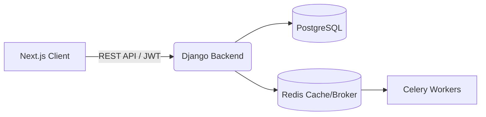
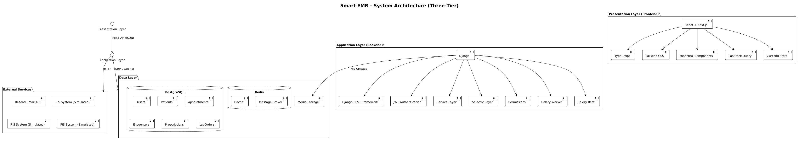
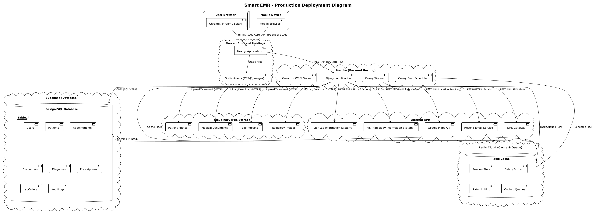
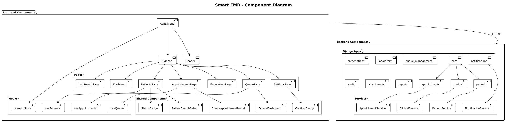
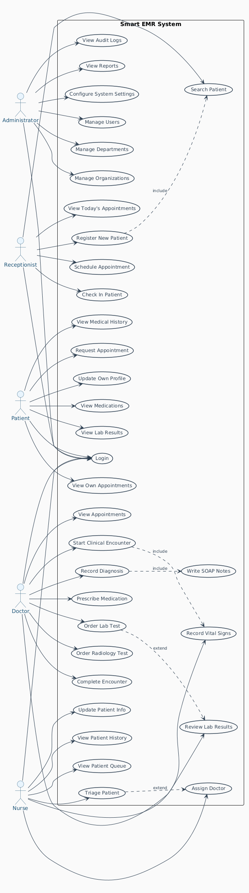
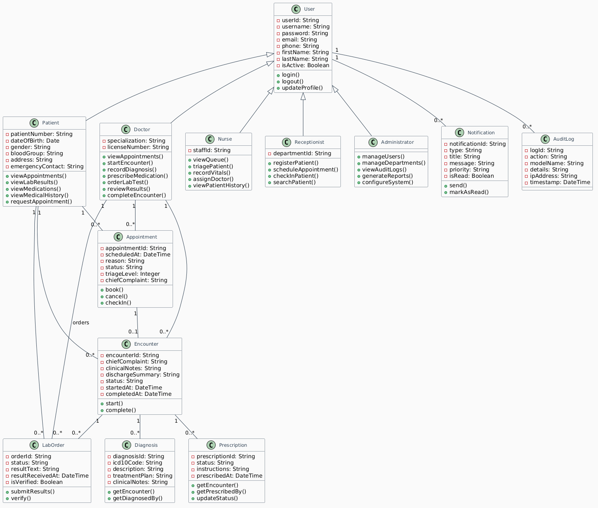
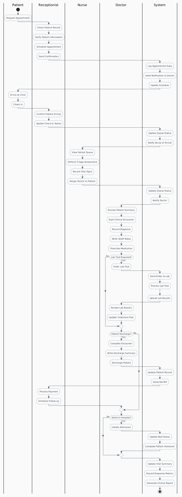

<div align="center">
  <h1>🏥 Smart EMR System</h1>
  <p><strong>A Next-Generation, Full-Stack Electronic Medical Record Platform</strong></p>

  [](https://python.org)
  [](https://djangoproject.com)
  [](https://nextjs.org)
  [](https://typescriptlang.org)
  [](https://postgresql.org)
  [](https://redis.io)
</div>

<br />

## 📋 Overview

**Smart EMR** is an enterprise-grade Electronic Medical Record system engineered to seamlessly digitize and optimize healthcare workflows. 

Built with a robust Django service-layer architecture and a highly responsive Next.js frontend, it supports the entire patient journey—from reception and queue management to clinical encounters, laboratory processing, and pharmacy dispensing.

**Key Highlights:**
- **Strict Clinical Workflows:** Accurately models real-world hospital processes (e.g., separate Triage vs. Clinical Encounter vitals).
- **High Concurrency:** Utilizes Django `@transaction.atomic` for robust state mutations and race-condition prevention.
- **Role-Based Access Control (RBAC):** Deeply integrated 7-tier role system ensuring strict data compartmentalization (Doctors only see their patients, etc.).
- **Asynchronous Processing:** Celery and Redis handle heavy lifting for notifications, reporting, and background tasks.

---

## 🏗️ Architecture

The system follows a strict decoupling of the client and server, communicating via a RESTful API secured by JWT.



### Backend Design Pattern
The Django backend strictly adheres to the **Service Layer Pattern**:
`Models → Selectors (Queries) → Services (Business Logic) → Serializers → ViewSets`

---

## 📊 System Diagrams

<details>
<summary><strong>1. Architecture & Deployment Diagrams</strong> (Click to expand)</summary>

### System Architecture


### Deployment Architecture


### Component Architecture

</details>

<details>
<summary><strong>2. Structural & Behavioral Diagrams</strong> (Click to expand)</summary>

### System Use Cases


### Class Diagram


### Activity Workflow

</details>

<details>
<summary><strong>3. Sequence Diagrams</strong> (Click to expand)</summary>

### Complete Patient Journey


### Patient Appointment Booking


### Doctor Consultation Workflow


### Laboratory Test Workflow

</details>

---

## 🚀 Features

### Core Clinical Modules
- **🔐 Advanced Authentication:** JWT-based auth with HttpOnly cookie support and Zustand state persistence.
- **👥 Patient Management:** Complete demographic tracking, allergies, and medical history.
- **📅 Appointment & Queue Management:** Scheduling, Check-ins, and an ESI (Emergency Severity Index) based real-time priority queue.
- **🩺 Clinical Encounters:** Comprehensive SOAP notes, ICD-10 Diagnosis tracking, and longitudinal vital signs.
- **💊 E-Prescribing & Pharmacy:** Doctor-to-Pharmacist prescription handoff workflow.
- **🔬 Laboratory & Radiology:** Order tracking, result uploads, and RIS/LIS mock integrations.
- **🛡️ Audit Logging:** Immutable audit trails for all critical clinical actions (e.g., prescribing, diagnosing).

---

## 🛠️ Technology Stack

| Layer | Technology |
|-------|-----------|
| **Frontend** | React 19, Next.js 16, TypeScript, Tailwind CSS, Zustand, React Query |
| **Backend** | Django 4.2+, Django REST Framework (DRF) |
| **Database** | PostgreSQL 16 |
| **Cache & Broker** | Redis 7 |
| **Background Tasks**| Celery & Celery Beat |
| **Testing** | Pytest, Vitest, Playwright E2E |

---

## 💻 Local Development Setup

### Prerequisites
- Node.js (v20+)
- Python (v3.13+)
- PostgreSQL installed and running
- Redis installed and running

### 1. Repository Setup
```bash
git clone https://github.com/mehari06/Smart-EMR-System.git
cd Smart-EMR-System
```

### 2. Backend Setup (Django)
Open a new terminal and navigate to the `backend` directory.

```bash
cd backend
python -m venv venv

# Activate Virtual Environment
# Windows:
venv\Scripts\activate
# macOS/Linux:
source venv/bin/activate

# Install dependencies
pip install -r requirements.txt

# Environment variables
cp .env.example .env
# Edit .env and configure your DATABASE_URL and REDIS_URL

# Run database migrations
python manage.py migrate

# Create an admin user
python manage.py createsuperuser

# Start the Django development server
python manage.py runserver
```

### 3. Frontend Setup (Next.js)
Open a new terminal and navigate to the `emr-frontend` directory.

```bash
cd emr-frontend

# Install Node dependencies
npm install

# Environment variables
cp .env.example .env.local

# Start the Next.js development server
npm run dev
```

### 4. Background Workers (Celery)
For background tasks (like notifications and report generation), start Celery in a new terminal:
```bash
cd backend
# Windows:
celery -A config worker --loglevel=info --pool=solo
# macOS/Linux:
celery -A config worker --loglevel=info
```

---

## 🧪 Testing

The project maintains high coverage across both stacks.

**Backend Tests (Pytest):**
```bash
cd backend
pytest -v
```

**Frontend Unit Tests (Vitest):**
```bash
cd emr-frontend
npm run test:unit
```

**End-to-End Tests (Playwright):**
```bash
cd emr-frontend
npx playwright test
```

---

## 👥 User Roles & Permissions

The system defines 7 strict roles, managed via custom Django Permissions and Frontend route guards:

| Role | Access Level / Capabilities |
|------|---------------------------|
| **Admin** | Full system access, staff management, organization configuration. |
| **Doctor** | Can start encounters, record vitals, prescribe, diagnose, and order labs. |
| **Nurse** | Can perform triage, record baseline vitals, and manage the priority queue. |
| **Receptionist** | Can register patients, schedule appointments, and manage check-ins. |
| **Pharmacist** | Can view active prescriptions and mark them as dispensed. |
| **Lab Tech** | Can view pending lab orders and upload test results. |
| **Patient** | Can access the self-service portal (appointments, personal history). |

---

## 📁 Repository Structure

```text
Smart-EMR-System/
├── backend/                  # Django REST API
│   ├── config/               # Core Django settings & Celery config
│   ├── core/                 # Auth, Users, Roles, Departments
│   ├── patients/             # Patient demographics & history
│   ├── appointments/         # Scheduling & Triage
│   ├── clinical/             # Encounters, Diagnoses, Vitals
│   ├── prescriptions/        # E-prescribing
│   ├── laboratory/           # Lab tests & results
│   ├── queue_management/     # ESI Priority Queue
│   ├── audit/                # Immutable action logging
│   └── conftest.py           # Universal pytest fixtures
│
├── emr-frontend/             # Next.js Application
│   ├── app/                  # Next.js App Router pages
│   ├── components/           # Reusable UI components (shadcn/ui)
│   ├── lib/                  # API client (Axios) & utilities
│   ├── store/                # Zustand global state (Auth, UI)
│   └── types/                # TypeScript interfaces
│
└── README.md                 # Project documentation
```

---

## 🛡️ Security Posture

- **No Mass Assignment:** Serializers strictly utilize `read_only_fields` to prevent privilege escalation.
- **IDOR Protection:** `get_queryset` is strictly scoped at the ViewSet level. Doctors can only fetch data linked to their `staff_profile`.
- **Atomic Transactions:** All clinical mutations (e.g., closing an encounter and saving vitals) are wrapped in `transaction.atomic` to prevent partial database states.

---

## 📄 License
This project is for educational and portfolio purposes.

## 👤 Author
**Mehari** - 2026
